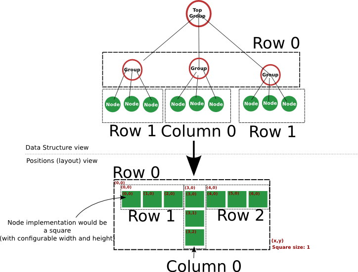

Scene Graph API
======================

# Overview

The Scene Graph API provides a set of functionalities to create a tree of nodes, layout them locally (i.e define their x,y position relative to their first parent), and get the global tree absolute positions.
It is designed to hierarchically structure nodes that sould have a position and a size (x,y,width,height), to produces pictures, placement datas etc...

The API provides two kind of nodes:

- Node
    - This is the top class
    - A node must provide its width and its height
- Group
    - A group can contain some other nodes/groups
    - The width and height of the group is determined by the positions of its members (mostRight - mostLeft, mostDown - mostUp)

All X/Y positions are meant to be relative to the containing group, so that the user can easily organize the nodes withing groups, without caring abour their actual location in the tree (using row/column/grid etc... functions)

The Absolute positions are calculated for each node by the API, by resolving the absolute positions of the parent nodes, and adding its own local relative position 

# Layouting

Layouting consists in positioning nodes in respect to their first parent.
Basically, all the nodes must provide their size:

- Either through the selected implementation (see next chapter)
- The group class automatically calculates its width and height

Example:

The row layout function positions the members of a group in a single row:

- set nextX , nextY to 0
- loop on group members
    - set member's x,y to $nextX , $nextY
    - update nextX by adding the member's width 

## Constraining

Layout functions can get some constraints passed when calling them.
Constraints are just a map of "key value" datas.

For example, most layout functions will support a "spacing" constraint, used to add extra space between nodes when calculating positions

# Implementation Layer

We have seen that the scene graph library only provides the basic layouting and positioning functions, but remains application agnostic.

This means that an Implementation layer must be provided, that create Nodes and Groups that are relevant to the specific usage of the Scene Graph API 

Such implementations can provide interfaces to standard data structures, like SVG, or support for an application specific object set (like floorplaning of macro blocks in ASIC/FPGA)

## SVG Support

An SVG interface is provided by the module. It may not be very complete, but will provide the basic required functionalities

### Supported SVG elements

At the moment, following SVG elements are supported:

- rect
- text

### Text size estimation

One main problem with the usage of text node, is that the user don't provide explicit width and height used by the text, making correct position calculations difficult for the API.
Fortunately, using the Tk GUI package of TCL, the text implementation is capable of estimating the rendering of a text in a specified Font configuration.

However, at the moment, this functionality forces the opening of a Tk window, which can be safely closed after picture creation to let the script finish.

### Example with SVG
    
    ~~~~~~~~~
    #!/usr/bin/env tclsh

    # Load library
    package require odfi::scenegraph::svg 1.0.0

    ## Create an SVG object which is the top Group entry point for the SVG implementation
    ::new odfi::scenegraph::svg::SVG "::svg" {

        ## Add 4 rectangles
        ##########
        ::repeat 4 {

            ## addRect is provided by the SVG Group implementation
            ## It creates a Node, which is a SVGNode, allowing sizing and definition of some common svg attributes (like color, stroke etc...)
            addRect {

                width  20
                height 20
                color "red"

            }

        }

        ## Call the layout function called flowgrid, with columns constraint.
        ## It will position our rectangles in two rows of two columns    
        layout "flowGrid" {
            columns 2
        }

    }
    ~~~~~~~~~~
